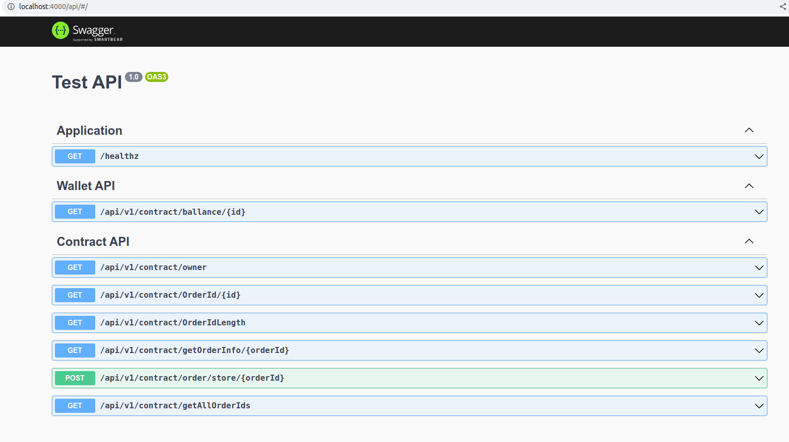

## Для установки:

- Клонировать репозиторий
- Выполнить команды: 0. yarn 0. yarn build 0. docker-compose up
- Выполнить запуск приложения 0. yarn start:dev

  ### Приложение запустится на localhost:4000

  - Swagger:
    http://localhost:4000/api/#/

    
